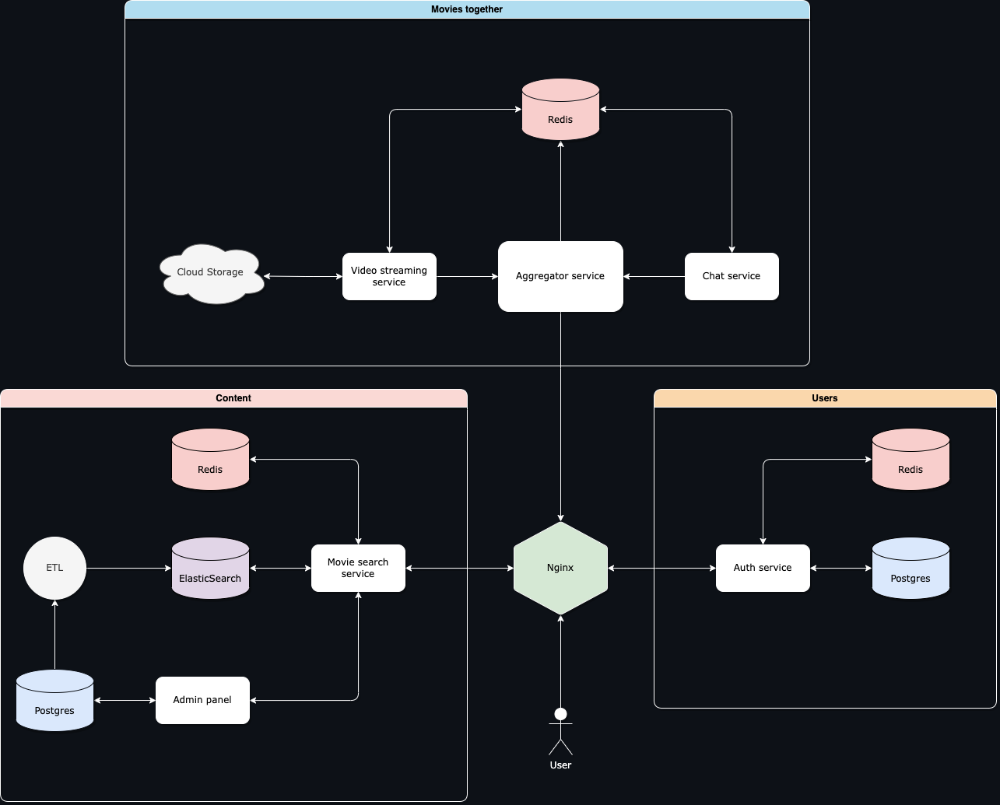

# Movies Together

Movies Together is a Python-based web application that allows you to watch movies together with your friends, family, or anyone you choose, no matter where they are in the world. The application uses a variety of different Python technologies, including Django, FastAPI, Flask, Elasticsearch, Redis, and WebSockets, to provide an immersive and interactive experience.

## Features
Movies Together has several unique and exciting features that set it apart from other movie-watching platforms. These features include:




### Django Admin Panel
The Django Admin Panel is used to manage the backend of the application. This is where the administrator can manage movie listings, and perform other administrative tasks.

### Movie Together Service
The Movie Together Service is a FastAPI-based service that allows users to watch movies together in real-time. This service includes features such as chat, jointly movie control, and party control, all of which are implemented with WebSockets.

### Authentication Service
The Authentication Service is a Flask-based service that provides authentication and authorization capabilities to the application. This service uses JWT to authenticate users, ensuring that only authorized users can access the application.

### Movie Search Service
The Movie Search Service is another FastAPI-based service that uses Elasticsearch and Redis to allow users to search for movies. This service provides a comprehensive search capability, allowing users to search for movies by title, genre, rating, or other criteria.

### Frontend
The frontend of the application, providing an elegant and user-friendly interface that is easy to navigate and use.

# Easy to Get Started
First, you will need to create `.env` file by copying the `.env.example` file. Then, you will need to fill in the values for the environment variables. The values for the environment variables can be found in the `.env.example` file.

```console
docker-compose up --build
``` 
```console
make migrate
```
This will build and start all of the required services, including the frontend, backend, and database.


